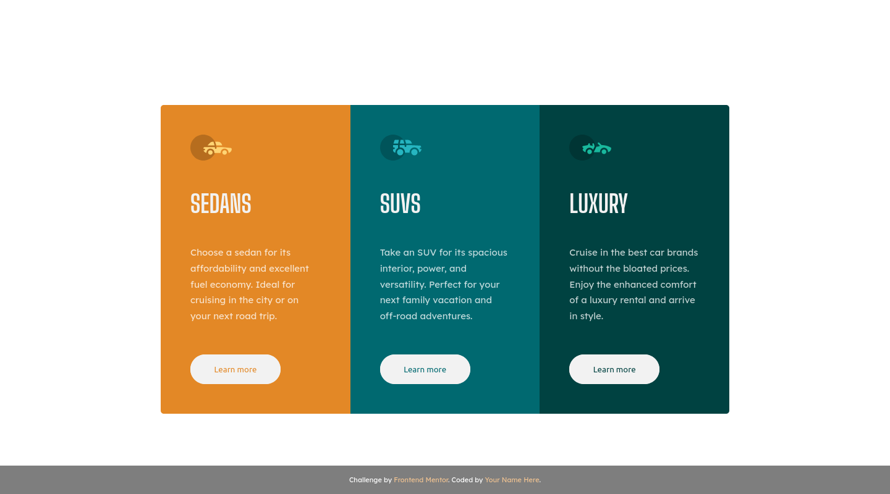

# Frontend Mentor - 3-column preview card component solution

This is a solution to
the [3-column preview card component challenge on Frontend Mentor](https://www.frontendmentor.io/challenges/3column-preview-card-component-pH92eAR2-)
. Frontend Mentor challenges help you improve your coding skills by building realistic projects.

## Table of contents

- [Overview](#overview)
    - [The challenge](#the-challenge)
    - [Screenshot](#screenshot)
    - [Links](#links)
- [My process](#my-process)
    - [Built with](#built-with)
    - [What I learned](#what-i-learned)
- [Author](#author)

**Note: Delete this note and update the table of contents based on what sections you keep.**

## Overview

### The challenge

Users should be able to:

- View the optimal layout depending on their device's screen size
- See hover states for interactive elements

### Screenshot

### Links

- Solution
  URL: [https://github.com/HubertSzymanski5/frontend-mentor-3-column-preview-card-component](https://github.com/HubertSzymanski5/frontend-mentor-3-column-preview-card-component)
- Live Site URL: [https://frontend-mentor-3-column-preview-card-component-umber.vercel.app/](https://frontend-mentor-3-column-preview-card-component-umber.vercel.app/)

## My process

### Built with

- Semantic HTML5 markup
- CSS custom properties
- Flexbox
- CSS Grid

### What I learned

I learned about `display: grid` to create tree even columns. I've also learned that
I can use inkscape to measure some parts of image design to cet closer to design image ;)

## Author

- Frontend Mentor - [@HubertSzymanski5](https://www.frontendmentor.io/profile/HubertSzymanski5)
